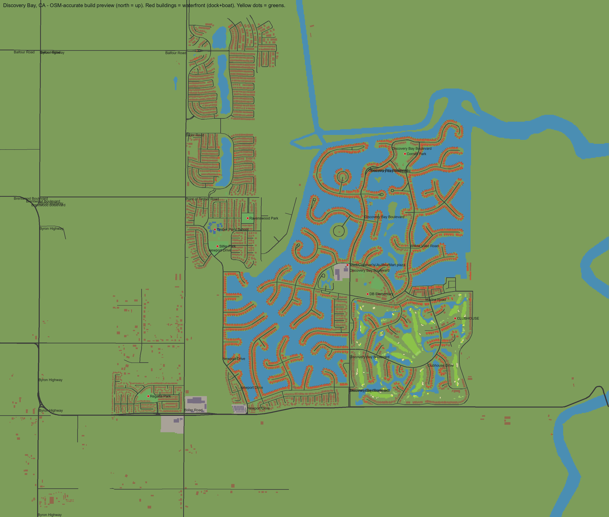

# Discovery Bay, CA — Roblox Replica (OSM-accurate)

Builds the **real Discovery Bay** in Roblox Studio from OpenStreetMap survey data
(© OpenStreetMap contributors, ODbL):

- **5,595 real buildings** at their true positions, sizes, and orientations —
  houses exist only where real houses are (nothing on the golf side of Cherry Hills Dr)
- **2,391 waterfront homes**, each with a private **dock and boat** on the real lagoon
- every **lagoon / bay water polygon**, Old River, and the Delta edges — correctly
  oriented (bays east, golf west — **not mirrored**)
- **all ~250 real named streets** (Discovery Bay Blvd, Willow Lake Rd, Cherry Hills Dr,
  every court) with street signs, cul-de-sac bulbs, and causeways over the water
- the **full 18-hole golf course**: real fairways, greens (with pin flags), tees,
  bunkers, water hazards, and cart paths, plus the clubhouse
- **Discovery Bay Elementary School** and **Timber Point School** (campus + sign + flag +
  playground), the four parks (Cornell, Slifer, Ravenswood, Regatta)
- the **Hwy-4 shopping center with its real stores** (McDonald's, CVS, Starbucks,
  Round Table Pizza, banks…) via signed commercial buildings
- the **yacht harbor** (covered slips, boats, launch ramp, lighthouse) at Marina Road
- required businesses at the real Discovery Bay Blvd plaza: **Callahan's Coffee and
  Cones, Discovery Bay Jiu Jitsu, Shell Gas Station, Convenience Mart**



World size at default scale: **~22,000 × 18,700 studs** (1 stud = 1 ft, the real 4.2 × 3.5 mi).
Roughly **93,000 anchored parts**; StreamingEnabled is set automatically. Build time in
Studio: about 1–3 minutes (progress prints in Output).

---

## Install — easiest way: open the place file

1. Double-click **`DiscoveryBay.rbxlx`** (or in Studio: File → Open from File).
   Both scripts come pre-installed in ServerScriptService with the right names.
2. In the **Command Bar** run (Ctrl+Enter):

   ```lua
   loadstring(game.ServerScriptService.DiscoveryBayBuild.Source)()
   ```

3. Wait for `[DiscoveryBay] DONE` in Output (~10 s), zoom out (select the
   DiscoveryBay model in Explorer, press F), **Ctrl+S** to save.

Regenerate `DiscoveryBay.rbxlx` any time with `python osm/make_place.py`.

<details><summary>Manual install into an existing place (two pastes)</summary>

1. **Explorer → ServerScriptService → + → ModuleScript.** Rename it exactly
   `DiscoveryBayData`. Open it, Ctrl+A, then paste the entire contents of
   [`DiscoveryBayData.luau`](DiscoveryBayData.luau).
2. **Explorer → ServerScriptService → + → Script.** Rename it `DiscoveryBayBuild`
   (make sure it sits directly under ServerScriptService, not inside the ModuleScript).
   Open it, Ctrl+A, then paste the entire contents of [`build.luau`](build.luau).
3. Run the same command-bar line as above.

</details>

**Re-running is safe** — the previous build is deleted and rebuilt. Same seed ⇒
identical world. Delete the default Baseplate for a clean look; a SpawnLocation is
placed at the plaza on Discovery Bay Blvd.

## Tuning (`CONFIG` at the top of `build.luau`)

| Setting | Default | Notes |
|---|---|---|
| `worldScale` | `1.0` | studs per foot. `0.5` = half-size world (everything scales uniformly). |
| `seed` | `94505` | deterministic house colors/stories, boats, trees. |
| `boatChance` | `1.0` | boat at every private dock. |
| `treeCount` | `1200` | scattered trees (parks get their own). |
| `region` | `nil` | `{x0, z0, x1, z1}` in feet to build a subset, e.g. `{7000, 2000, 22011, 15500}` ≈ just the bay neighborhoods + golf course. |
| `build.*` | all on | stage switches: ground, roads, buildings, docks, golf, landmarks, props. |

Performance: ~93k parts is desktop-class. If it's heavy, use `region`, set
`boatChance = 0.5`, or `worldScale = 0.5`.

## How the data was made (fully regenerable)

```
osm/fetch_osm.py        downloads raw OSM (cached raw_*.json)
osm/generate.py         projects to local feet, classifies terrain, encodes
                        -> DiscoveryBayData.luau + osm/layout_debug.json
preview.py              renders preview.png from the same data
osm/verify_encoding.py  proves the base36/RLE encoding round-trips exactly
osm/simulate_runtime.py simulates dock marching / marina anchor / part budget
```

Python 3 with `shapely`, `numpy`, `Pillow` (all installed). To refresh from the live
map: delete `osm/raw_*.json`, run `fetch_osm.py`, `generate.py`, `preview.py`, then
re-paste `DiscoveryBayData.luau` into Studio and re-run.

## Honest limits

- Buildings are stylized block architecture (real footprint, size, and orientation;
  procedural walls/roofs) — OSM doesn't carry per-home appearance.
- Terrain is a 25-ft raster of the real polygons; shorelines are crisp to ~12 ft.
- OSM has no marina *basin* polygon, so the yacht harbor anchors to the real Marina
  Road water end; slips/lighthouse layout there is stylized.
- Water is flat translucent parts (convert to Terrain water by hand if preferred).

`legacy/` holds the first schematic version; `reference/` the original hand-off spec.
